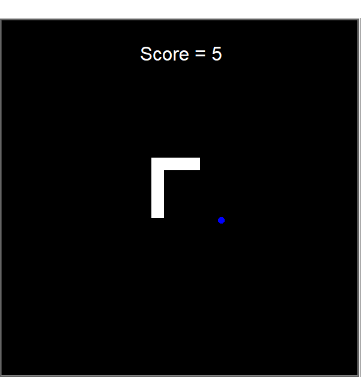

# Snake Game

## 

A classic remake of the legendary Snake game, one of the most iconic and widely played games from the era of Nokia phones.

## How it works

Use the arrow keys to control the snake as it moves across the screen, consuming food to grow longer. Avoid crashing into the walls or yourself—survive as long as possible to achieve the highest score!

**🔥 The goal? Rack up the highest score possible!**

**⚡ Warning: Highly Addictive!**

## More About this project

This project was created to apply Python skills in a real-world scenario by building an intermediate-level game. The idea originated from one of the projects in my [Python Course](https://www.udemy.com/course/100-days-of-code/), serving as a fun and practical coding challenge.

### Builts With

- Python – Handles game logic and functionality
- Turtle Module – Manages graphics and rendering
